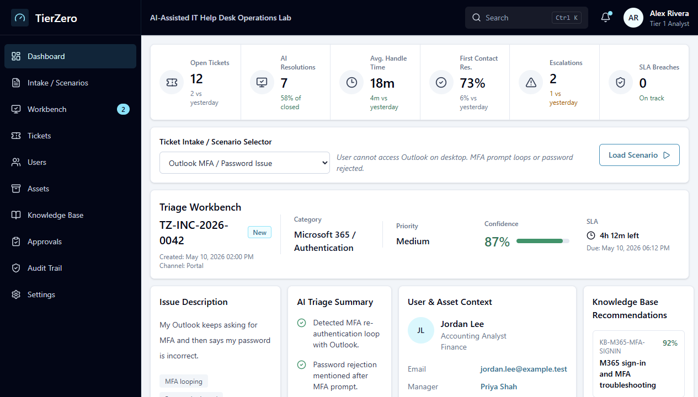

# TierZero: AI-Assisted IT Help Desk Operations Lab

TierZero is a realistic AI-assisted help desk operations lab that shows how Tier 1 support teams can intake tickets, collect required troubleshooting facts, follow knowledge-base checklists, draft user responses, escalate safely, close with documentation, and preserve an audit trail.

## Live Demo

The public demo is designed to run as a static web app with fictional sample data and deterministic recommendations. It does not require login, expose API keys, or connect to real user accounts.

> Live demo: [rblea97.github.io/tierzero-helpdesk-lab](https://rblea97.github.io/tierzero-helpdesk-lab/)



## Tech Stack

| Technology | Why it was chosen |
| --- | --- |
| React + Vite + TypeScript | Fast static demo with clear component boundaries and type-safe domain logic |
| Tailwind CSS | Compact operations-console styling without a heavy UI framework |
| Vitest + ESLint | Repeatable checks for triage behavior and code quality |
| Static fictional data | Safe public demo with no secrets, credentials, or real users |
| GitHub Pages | Free static hosting that fits a recruiter-friendly portfolio demo |

## Key Features

- Create fictional support tickets through an interactive intake form
- Work tickets through queue states such as New, In Progress, Pending User, Escalated, and Closed
- Collect required Tier 1 facts for scope, exact error, business impact, verification, and attempted fixes
- Track interactive checklist progress for each ticket instead of static recommendations
- Use AI-assist panels for next question, KB match, response draft, escalation summary, and safety flags
- User, department, and device context linked to each ticket
- Require realistic documentation before user responses, escalations, and ticket closure
- Persist live-demo work in the browser with a Reset Demo control
- Capture technician notes, approvals, escalations, responses, closure events, and workflow events in the audit timeline

## Quick Start

```powershell
pnpm install
pnpm dev
```

Run the validation checks:

```powershell
pnpm typecheck
pnpm test
pnpm lint
pnpm build
```

Preview the production build locally:

```powershell
pnpm build
pnpm preview
```

## Demo Workflow

The demo lets a reviewer create a fictional ticket, select it from the queue, run guided triage, collect required facts, complete checklist work, save an internal note, send a safe user response, escalate or close the ticket with documentation, refresh the page to confirm browser persistence, and review the audit timeline.

The default workflow starts with a sample ticket such as:

> "My Outlook keeps asking for MFA and then says my password is incorrect."

TierZero then shows:

- Category, priority, and confidence output
- Linked fictional user, department, and asset record
- Interactive ticket queue and status filters
- Recommended knowledge-base article
- Interactive Tier 1 troubleshooting checklist
- Required fact collection for ticketing discipline
- User-facing response draft
- Saved internal technician notes
- Tier 2 escalation summary
- n8n-style automation blueprint for the planned homelab proof layer
- Human approval gate
- Audit timeline with technician actions

## Safety Model

TierZero is designed to show safe IT operations:

- No real user data
- No public API keys
- No real password resets or account changes
- No exposed homelab services
- Simulated public recommendations for reliability and privacy
- Human approval required before sensitive actions
- Audit events for all important workflow decisions

## Challenges and Solutions

| Challenge | Solution |
| --- | --- |
| Make the demo feel like real IT work without exposing real systems | Split the project into a static public demo and a later private homelab proof layer |
| Show AI assistance without implying unsafe automation | Use deterministic recommendations, explicit safety notes, approval gates, and audit events |
| Keep the project manageable for an entry-level portfolio | Build GLPI, n8n, and Ollama as future adapter targets instead of MVP dependencies |
| Prove ticketing discipline during a live demo | Require facts, checklist progress, escalation reasons, response history, and closure notes before key actions |

## Project Timeline

TierZero is organized as a phased portfolio build:

1. **Architecture and safety model:** define the public demo, private homelab boundary, data model, and approval-first operating model.
2. **Demo foundation:** build the React/Vite app, mock ITSM data, triage logic, and operations-console layout.
3. **Workflow credibility:** add scenario switching, user and asset context, KB recommendations, guided triage, audit events, approval states, and browser persistence.
4. **Portfolio presentation:** add README polish, deployment workflow, public runbooks, demo script, screenshot, and regression tests.
5. **Future homelab proof:** connect GLPI and n8n locally behind adapters after the public demo is live.

## Architecture

TierZero uses a two-layer architecture: a static public demo for safe portfolio review and a future homelab proof layer for real-tool integrations. The app keeps triage, mock data, workflow events, and future integrations separated so the public demo can later map to GLPI, n8n, and local-only model tooling without rewriting the UI.

See [ARCHITECTURE.md](ARCHITECTURE.md) for the full architecture notes.

## Real-Tool Roadmap

After the public demo is complete, the homelab version will add:

1. GLPI for ITSM, asset management, users, categories, and knowledge base.
2. n8n for visual workflow automation.
3. Optional local Ollama integration for private classification and summarization tests.
4. Optional ServiceNow or Jira Service Management comparison notes.
5. Optional monitoring/audit dashboard using Grafana and Loki.

Windows Server, Active Directory, and Microsoft 365/Entra integration are optional advanced modules, not MVP requirements.

## Documentation

- [Architecture](ARCHITECTURE.md)
- [Implementation Plan](docs/IMPLEMENTATION_PLAN.md)
- [Demo Script](docs/DEMO_SCRIPT.md)
- [Runbook Template](docs/RUNBOOK_TEMPLATE.md)
- Sample KB articles:
  - [Microsoft 365 Sign-in and MFA Troubleshooting](docs/kb/m365-sign-in-mfa.md)
  - [Printer Offline Troubleshooting](docs/kb/printer-offline.md)
  - [Phishing Report Handling](docs/kb/phishing-report.md)

## Deployment

GitHub Actions validates pull requests with typecheck, tests, linting, and a production build. Pushes to `main` deploy the Vite `dist` output to GitHub Pages.

For a repository Pages URL such as `https://USERNAME.github.io/REPO/`, the Vite base path is set automatically in GitHub Actions. For a custom domain, set `VITE_BASE_PATH=/` in the deployment environment.

## License

MIT License. See [LICENSE](LICENSE).
